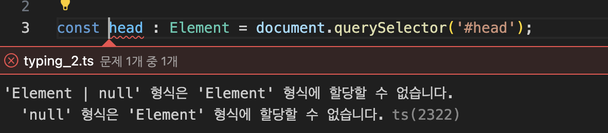
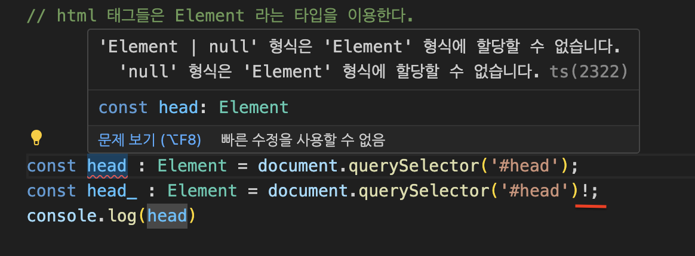

## 타입스크립트에서 리턴 타입을 지정할 때 :과 =>를 사용하는 데는 구체적인 차이와 각각의 사용 상황이 있습니다.   
이 두 기호의 주요 차이는 문맥과 사용 방식에 있습니다.

### : 콜론 사용
: 는 주로 함수 선언, 함수 표현식, 메서드 선언에서 함수의 리턴 타입을 명시할 때 사용됩니다.  
이 기호는 함수의 매개변수 목록 바로 뒤에 오며,  
이 함수가 어떤 타입의 값을 리턴할 것인지를 나타냅니다.

```typescript
function add(x: number, y: number): number {
  return x + y;
}

const subtract = function(x: number, y: number): number {
  return x - y;
};
```
위 예제에서 add 함수와 subtract 함수 표현식 모두 : 뒤에 오는 number를 통해 함수의 리턴 타입이 number임을 명시합니다.

### => 화살표 사용
=> 는 주로 함수 타입을 정의할 때 사용됩니다.  
이 기호는 함수의 매개변수 타입과 리턴 타입 사이에 위치하여,  
특정 함수가 받을 매개변수의 타입과 이 함수가 리턴할 값의 타입을 설명하는 데 사용됩니다.  
이 형식은 변수에 함수 타입을 할당하거나,  
콜백 함수의 타입을 지정하는 등의 상황에서 유용하게 사용됩니다.  

```typescript
let myFunction: (x: number, y: number) => number;

myFunction = function(x, y) { return x + y; };
```  

여기서 myFunction은 (x: number, y: number) => number 타입을 가지는데,  
이는 myFunction이 number 타입의 두 매개변수를 받아 number 타입의 값을 리턴하는 함수임을 나타냅니다.  
  
---

### 요약
:는 함수의 리턴 타입을 직접 명시할 때 사용합니다.  
함수 선언이나 함수 표현식에서 매개변수 목록 뒤에 위치합니다.  
  
=>는 함수 타입을 정의할 때 사용합니다.  
이는 함수의 매개변수 타입과 리턴 타입 사이의 관계를 설명하는 데 사용되며,  
주로 함수 타입을 변수에 할당하거나, 콜백 함수의 타입을 지정하는 등의 상황에서 사용됩니다.
각각의 사용은 문맥에 따라 결정되며, 타입스크립트의 타입 시스템을 이해하고 적절히 활용하는 데 중요한 부분입니다.

---
---

## 타입단언 (Type Assertion) 과 타입가드 (Type Guard)  
  
### 해당코드에서는 무슨 문제가 있을까?


  
바로 document.querySelector('#head') 에서  
element가 나오기를 바라지만, 해당 요소가 존재하지 않을 때 null이 출력될 수도 있습니다.  
Element로 타입을 지정해주려하지만 타입스크립트에서는 저 요소가 null 이 나올 수도 있음을 지적하고 있는 것이구요.  
  
저런 상황( null이 나올 수도 있는 상황 )을 막기 위해,  
타입단언 이나 타입 가드를 사용해야 합니다.  
  

## 타입 단언(Type Assertion) 사용:  
타입 단언을 사용하여 querySelector의 반환 타입을 Element로 지정할 수 있습니다.  
이 경우, 코드를 작성하는 사람이 해당 요소가 반드시 존재한다는 것을 확신할 때 사용합니다.  
as 키워드를 사용합니다.  
  
```typescript
const head = document.querySelector('#head') as Element;
```  
  

## 타입 가드(Type Guard) 사용:  
코드에서 null인 경우를 처리하도록 타입 가드를 사용할 수 있습니다.  
  
```typescript
const head: Element | null = document.querySelector('#head');
if (head !== null) {
  // head는 여기서 Element 타입입니다.
}
```

## null 이나 undefined가 출력이 안될거라는 걸 확신할 수 있는 상황이라면?

이미지에서 보이는 바와 같이 코드의 맨끝에 ! (느낌표)를 붙여주면 됩니다.
! 가 있으면, null 이나 undefined 가 아님을 보증하는 역할을 합니다.



### 그래도 ! 는 안쓰는 편이 좋다. (절대 라는건 없다!)

---

TypeScript가 엄격한 타입 검사를 수행하고 있음을 알 수 있습니다.  
따라서 null 가능성을 처리하는 것이 좋습니다.  

---
---


# 타입스크립트 튜플 동작 📝

타입스크립트의 튜플은 고정된 크기와 각 요소에 대해 미리 정해진 타입을 가진 배열입니다.  
예를 들어, `[string, number]` 타입의 튜플은 정확히 두 개의 요소를 가져야 하며,  
첫 번째 요소는 문자열이고 두 번째는 숫자여야 합니다.

## 제공된 코드 🧩

```typescript
const tuple: [string, number] = ['1', 1];
tuple[2] = 'hello';  // 오류: 타입 '[string, number]'에는 인덱스 '2'가 존재하지 않습니다.
tuple.push('hello'); // 동작은 하지만 권장되지 않음 (아래 내용 참조)
```

## 설명 📖

코드의 첫 번째 줄은 두 개의 요소를 가진 튜플을 선언합니다:  

```typescript
const tuple: [string, number] = ['1', 1];
```

이 튜플은 첫 번째 요소가 `string` 타입이고 두 번째 요소가 `number` 타입이어야 합니다.  

### 인덱스 접근 🚫

튜플 내에 정의되지 않은 인덱스에 접근하려고 할 때, 다음과 같이:  

```typescript
tuple[2] = 'hello';
```

타입스크립트는 `[string, number]` 타입의 튜플은 정확히 두 개의 요소만 가져야 한다는 사실을 기반으로 오류를 발생시킵니다.  

### Push 메소드 ⚠️

하지만, `push` 메소드를 사용하여 튜플에 요소를 추가하는 경우:

```typescript
tuple.push('hello');
```

타입스크립트에서 오류가 발생하지 않습니다.  
이것은 타입스크립트 타입 시스템의 한계로,  
`push` 메소드는 튜플의 길이를 변경할 수 있으나,  
튜플은 길이가 변하지 않아야 한다는 원칙에 어긋납니다.  

## 결론 ✅

이론적으로 튜플은 고정된 길이를 가져야 하지만,  
실제 구현에서는 튜플에 배열 메소드가 적용될 수 있으며, 예상치 못한 동작을 초래할 수 있습니다.  
튜플의 무결성을 유지하고자 한다면, 길이를 변경하는 메소드 사용을 피해야 합니다.  

### 참고
타입스크립트 3.1 버전 이후로 튜플에 대한 타입 검사가 개선되었지만,  
사용하는 타입스크립트의 버전과 설정에 따라 경험이 달라질 수 있습니다.

---

 
