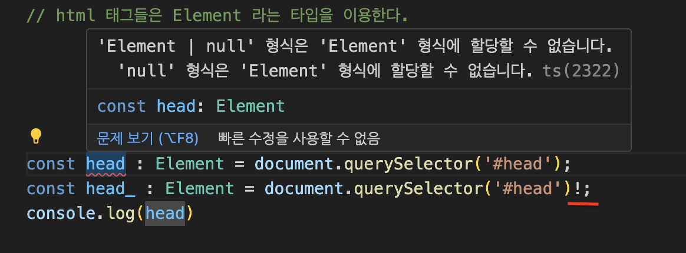

# TypeScript의 `void` 타입에 대해 알아보자 🤔

TypeScript에서 `void` 타입 함수가 값이 반환될 수 있는 이유는  
TypeScript의 타입 시스템이 자바스크립트의 유연성을 모델링하기 때문이다.  
`void` 타입 사용의 뒤에 숨겨진 의도와 그 사용법에 대해 자세히 알아보자.

## `void` 타입이란 무엇일까? 🧐

`void` 타입은 함수가 명시적으로 값을 반환하지 않거나,  
아무런 값을 반환하지 않을 때 사용된다.  
이는 주로 함수가 어떤 기능 (예: 로깅, 상태 변경 등) 만을 수행하고,  
호출자에게 어떠한 값을 반환할 필요가 없을 때 유용하게 사용된다.  

## 근데 왜 `void` 타입 함수에서 값을 반환할 수 있을까? 🤯

1. **자바스크립트의 유연성** : TypeScript는 자바스크립트 위에 구축되어 있으며, 자바스크립트의 유연성을 유지하고자 한다.    

2. **`undefined`와의 호환성** : `void` 타입 함수에서 `undefined`를 명시적으로 반환하는 것은 허용된다.  
이는 `void`의 의미인 "반환 값에 관심 없음"과 크게 어긋나지 않는다.  

3. **타입 안전성과 유연성 사이의 균형** : TypeScript는 타입 안전성을 제공하면서도 자바스크립트의 유연성을 손실하지 않으려 노력한다.  

## 예제 코드 📝

```typescript
function logMessage(): void {
    console.log("메시지를 로깅한다.");
    return; // 명시적으로 아무 것도 반환하지 않음
}

function returnUndefinedExplicitly(): void {
    console.log("이 함수는 명시적으로 undefined를 반환한다.");
    return undefined; // 명시적으로 undefined 반환
}
```

이 예시를 통해 볼 수 있듯이,  
`void` 타입은 함수가 어떠한 값을 반환하지 않겠다는 의도를 나타낸다.  

그러나 TypeScript는 자바스크립트의 기본적인 동작을 충실히 반영하고자 할 때  
`undefined`를 명시적으로 반환하는 것을 허용한다.

---
  
  
## 함수 표현식에서의 void

```typescript
type exFunction = () => void;

const exMyFunction : exFunction = function () {
  return 'hello'; // 성공
};
const exMyFunction2 : exFunction = () => {
  return 'hello'; // 성공
};
```

exFunction 함수를 정의하는 타입을 만들고, 함수 표현식에 타입을 지정해 사용했다.  
반환 타입이 void 임에도 에러가 발생하지 않는 코드다.  

exFunction 타입은, 함수의 반환 타입이 void 이고,  
exMyFunction, exMyFunction2 변수에 string 타입을 반환하는 함수가 할당되었다.
근데 왜 성공일까? 이상하다.



반환 값을 변수에 할당하고 마우스를 올려보면 사진과 같이 TypeScript는 반환 값을 void로 추론하고 있다.  
그렇다면 method는 어떨까?
  
## 메서드에서의 void

```typescript
const kim = {
    coding() : void {
        return 'coding'; // error! : 'string' 형식은 'void' 형식에 할당할 수 없습니다.
    },
    debug() : void {
        return {}; // error! : 'never[]' 형식은 'void' 형식에 할당할 수 없습니다.
    }
}
```

메서드에서 return 타입으로 선언했을 경우에는 에러가 발생한다.  

하지만, 아래 코드와 같이 메서드의 함수 형태의 타입을 만들고,  
이를 객체에 타입을 입힌 경우에는 에러가 발생하지 않는다.

```typescript
// type alias 대신, interface로 선언해도 마찬가지
type Dev_Jeon = {
  coding: () => void;
  java: () => void;
};

const jeon: Dev_Jeon = {
  // 메서드 축약 표현
  coding() {
    return 'coding!'; // 성공
  },
  // ES5 메서드
  java: function () {
    return 'java!'; // 성공
  },
};
```

TypeScript는 JavaScript가 런타임에서 발생하는 에러를 방지하기 위해 만들어졌다.  

void가 반환 타입으로 사용되면,
undefined를 제외하고 어떤 값도 return 시킬 수 없는게  
TypeScript의 의도에 맞을 것이다.  
근데 TypeScript에서 왜 이런 void 타입에 대한 예외를 두었을까?
  
## void에 예외를 둔 이유
  
### void의 2가지 방식  

1. 반환 값이 존재하면 안된다(undefind만 반환 가능하다).  
2. return에 어떤 값이 와도 상관은 없지만, 사용하지 않는다는 뜻으로 해석한다.

그럼, 반환 값이 있어도 에러가 나지 않는 코드의 예시를 살펴보자.  

```typescript
const a = [1, 2, 3, 4, 5];
const b = [0];

target.forEach(el => result.push(el));
```
  
  
forEach 메서드와 push 메서드가 사용되었는데, push 메서드는 배열의 길이를 반환한다.  

### lib.es5.d.ts 파일에 push가 어떻게 정의되어 있는지 확인해보자

```typescript
/**
 * Appends new elements to the end of an array, and returns the new length of the array.
 * @param items New elements to add to the array.
 */
push(...items: T[]): number;
```
  
위에서 봤던  
target.forEach(el => result.push(el));  
이 코드의 forEach 메서드는 콜백 함수의 타입은 number 가 되어야 하는 것이 맞다.  
lib.es5.d.ts 파일에 forEach는 어떻게 정의되어 있는지 확인해보자.  

```typescript
/**
 * Performs the specified action for each element in an array.
 * @param callbackfn  A function that accepts up to three arguments. forEach calls the callbackfn function one time for each element in the array.
 * @param thisArg  An object to which the this keyword can refer in the callbackfn function. If thisArg is omitted, undefined is used as the this value.
 */
forEach(callbackfn: (value: T, index: number, array: T[]) => void, thisArg?: any): void;
```
void가 총 두번 사용되었는데,  
콜백 함수에서 반환 타입인 void와,  
forEach 메서드 자체에서 반환 타입으로 사용된 void다.  
push 메서드의 명세를 살펴봤을 때는 number 타입을 반환한다고 했는데 이상하지 않은가?  
  
즉, callback 함수 내부의 push 메서드는 number 타입의 값을 반환하는데도 에러가 발생하지 않았다.  

코드로 다시 한번 검증해보자.  
push 메서드와 forEach 메서드를 커스텀하게 구현해보고,  
반환 타입이 void일 경우에도 반환 타입이 다른 콜백 함수가 허용되는지 알아보자.  
  
먼저, push 메서드를 본따서 exPushMethod 함수를 만들 것이다.
  
```typescript
type arrayEx<T> = {
  length: number;
  [key: number]: T;
};
const arr: arrayEx<string> = { 0: 'first', length: 1 };
const value = 'second';

function exPushMethod(array: arrayEx<unknown>, arg: unknown): number { // 반환 타입: number
  if (array.length) {
    array[array.length] = arg;
    array.length += 1;
  } else {
    array[0] = arg;
    array.length = 1;
  }
  return array.length;
}

console.log(exPushMethod(arr, value)); // 2
console.log(Array.from(arr)); // [ 'first', 'second' ]
```
myPush 메서드는 array에 값을 추가하고, 추가한 값을 return 한다. (ArrayLike는 그냥 넣어보았다..)  
  
이제, 방금 만든 myPush를 사용하는 myForEach를 만들어보자. 물론 forEach를 본땄다.  
  
``` typescript
type MyForEach<T> = (
  target: MyArrayLike<T>,
  callbackfn: (value: T, index: number, array: T[]) => void, // 반환 타입: void
  thisArg?: any
) => void; // 반환 타입: void

const myForEach: MyForEach<string> = (target, callbackfn, thisArg = null) => {
  for (let i = 0; i < target.length; i++) {
    callbackfn(target[i], i, Array.from(target)); // 이 부분에 myPush 함수가 들어오면, 반환 타입은 number.
  }
};

const newArr = { length: 0 };
myForEach({ 0: '0', 1: '1', 2: '2', 3: '3', length: 4 }, v => {
  return myPush(newArr, `${v}입니다`);
});

console.log(Array.from(newArr));
// ['0입니다', '1입니다', '2입니다', '3입니다']
```  

callbackfn의 반환 타입은 void 이지만,  
myForEach 함수 내부에서 실행된 callbackfn인, myPush는 number 타입을 반환한다.  
하지만 문제 없이 실행되었다.  
정리해보자.  
  
forEach 함수 내부의 콜백 함수의 반환 타입 void : 값을 반환할 수 있다.  

forEach 함수 자체의 반환 타입 void : 값을 반환할 수 없다.(undefined만 가능)  

왜 TypeScript에서 void 반환 타입을 사용해도, 값을 반환할 수 있도록 해두었을까?   

TypeScript의 타입 시스템은 JavaScript의 런타임 동작을 모델링하는 타입 시스템을 갖고 있다.  

따라서, TypeScript는 JavaScript를 문제 없이 구현하기 위해 void 반환 타입에 예외를 둔 것이다.  

JavaScript에서 forEach 메서드는 아주 흔하게 사용되는 메서드이고,  

인자로 받는 콜백 함수는 어떤 값도 반환하면 안된다.

하지만, 콜백함수가 어떤 값을 반환한다면 그 함수는 사용할 수 없는 함수인가?  

반드시 반환 값이 없는 함수만 콜백함수로 이용되어야 하는가?  

### JavaScript에서는 아니다.  

따라서 JavaScript와의 호환성 때문에 TypeScript는 이런 결정을 한 것으로 추측해볼 수 있다.  

콜백 함수를 단순화 해서 살펴보면 아래와 같다.  

```typescript
function callbackWrapper(callback: () => void): void {}
callbackWrapper(() => {
  return 10; // 성공
});
```
그렇다면, 정확히 언제 void가 값을 반환할 수 있고 값을 반환할 수 없을까?  

타입으로 분리되지 않은 함수 자체에 붙어 있는 void 값은  
return 값이 존재하면 안된다.  

타입으로 분리되거나 타입이 선언과 할당이 따로 나뉘어 있는 void 값은 값이 존재해도 된다.  

쉽게 코드 형태로 보면 아래와 같다.  

```typescript
function fn(): void {
  return 'a'; // 👾error! : 'string' 형식은 'void' 형식에 할당할 수 없습니다.
}
const fn2: () => void = () => {
  return 'a'; // 성공
};
```
  
즉,  
: void 구문은 반드시 return 값이 존재하면 안되고,  
() => void 구문은 return이 존재해도 된다.  
class 에서도 마찬가지 규칙이 적용된다.

### class에서의 void

```typescript
class MyClass {
  instanceMethod: () => void;
  constructor() {
    this.instanceMethod = () => {
      return 10; // 성공
    };
  }

  prototypeMethod(): void {
    return 'prototype'; // 👾error! : 'string' 형식은 'void' 형식에 할당할 수 없습니다.
  }

  static staticMethod(): void {
    return false; // 👾error! : 'boolean' 형식은 'void' 형식에 할당할 수 없습니다.
  }
}
```

인스턴스 메서드 : 값 반환 가능  

프로토타입 메서드 : 값 반환 불가능  

스태틱 메서드 : 값 반환 불가능  

인스턴스 메서드만 값을 반환해도 사용할 수 있다.  
인스턴스 메서드를 선언하고, 할당하는 형태가 마치 ’함수 표현식‘과 비슷하게 생겼다.  
타이핑 형태의 차이점은 아래와 같다.

인스턴스 메서드는 필드에서 타입이 선언 되었고,  
() => void 구문이 사용되었기 때문에 값을 반환할 수 있다.  
  
프로토타입, 스태틱 메서드는 : void 구문이 사용되었기 때문에 값을 반환할 수 없다.  
  
## 그럼에도 void 사용하기  
TypeScript는 컴파일 시점에 JavaScript 파일로 변환되어,  
타입과 관계 없이 void 타입을 지정했더라도 정상적으로 값이 반환 될 것이다.  
즉, return 문을 지정했더라도 그것을 활용할 수 있다.  
사라지는 타입 영역이 아닌, 값 영역이기 때문이다.  
  
그럼에도 void를 명시적으로 선언하기를 추천한다.  
  
```typescript
type VoidFunc = () => void;
const myFunc: VoidFunc = () => {
  return 'hello'; // 성공
};

let myString = myFunc(); // myString은 void 타입으로 추론된다.
myString = 'something'; // 👾error! : 'string' 형식은 'void' 형식에 할당할 수 없습니다.
```  

void로 반환 타입을 설정했고,  
void 타입의 값이 반환되어 myString 변수에 할당 되었다.  
그리고, myString에 string 타입의 리터럴 값을 할당했다. 그랬더니 에러가 발생했다.  
VoidFunc의 반환 타입을 보고 TypeScript가 myString 변수에 void 타입으로 반환 되었다고 추론하고 있기 때문이다.  
  
따라서 반환 타입이 타입으로 명시되어 있기 때문에,  
실제 값을 반환한다 하더라도 타입 검사에서 이를 체크해주기 때문에 안전한 타이핑이 가능하다.  
하지만, 아래와 같이 타입을 void -> unknown -> string 으로 단언해주면 사용은 가능하다.  

```typescript
let myString = myFunc() as unknown as string; // 타입 단언으로 우회
myString = 'something'; // 성공
```
  
하지만, 타입 단언은 위험하기 때문에 웬만하면 사용하면 안된다.  
정말 불가피하게 사용해야 한다면 as unknown as [원하는타입] 으로 사용하자.  
  
※ void는 타입단언으로 바로 원하는 타입으로 변경할 수 없고,  
모든 타입의 상위 타입인 unknown으로 단언 후 단언할 수 있다.  
  
void와 같이 어떨 때는 값을 반환해도 오류가 발생하지 않고, 어떨 때는 발생하는 지점이 있다.  

이는 JavaScript의 기존 동작을 헤치지 않고 타입을 보장해주어야 하기 때문인데,  
TypeScript에서 이런 부분이 꽤나 많다.  
예를 들면, 잉여 타입 체크라는 개념도 이와 비슷하다.  
  
void 반환 타입을 사용했는데 값을 반환 했음에도 타입 오류가 나지 않는다면 void 선언 위치를 잘 살펴보자.  
  
  
  